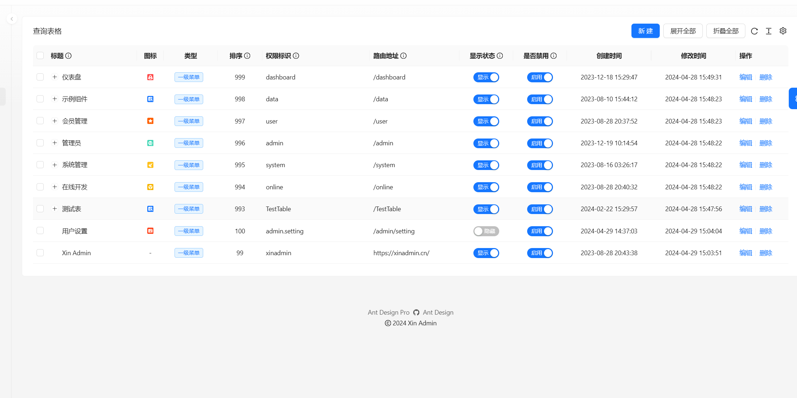
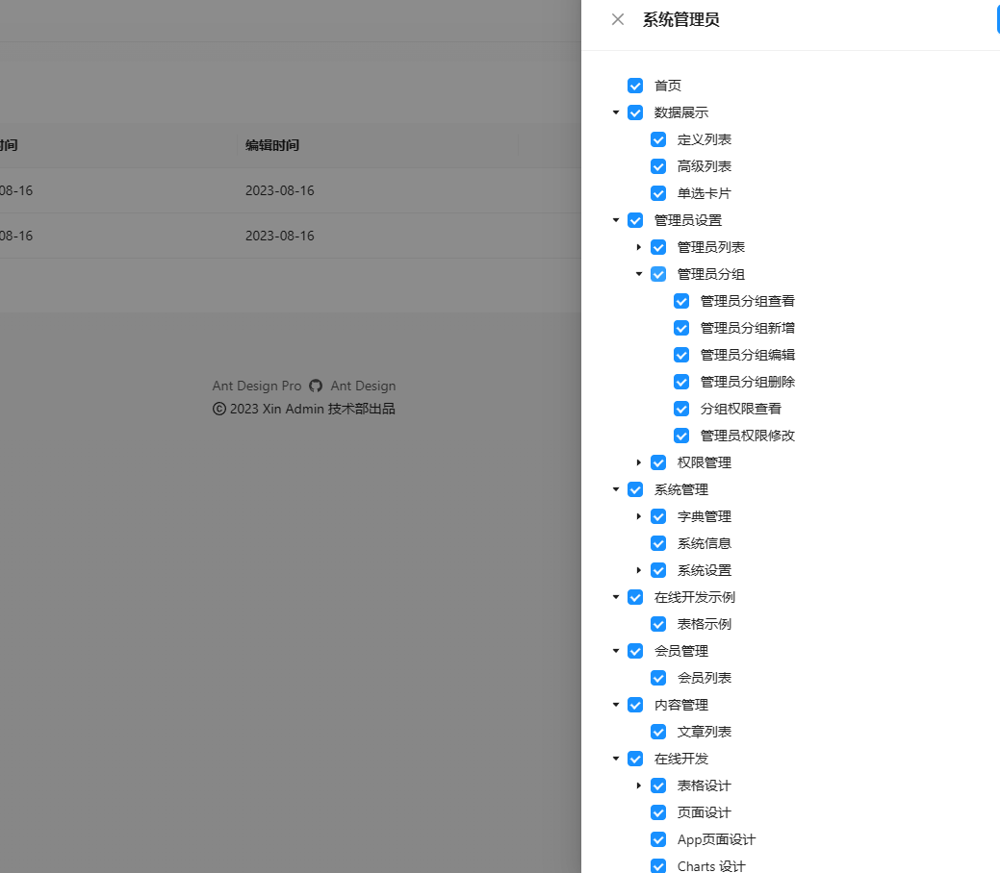
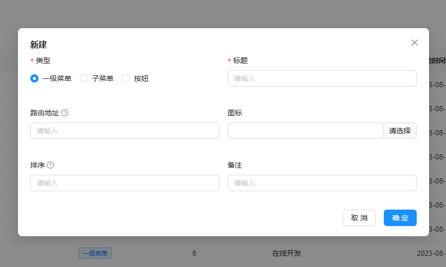
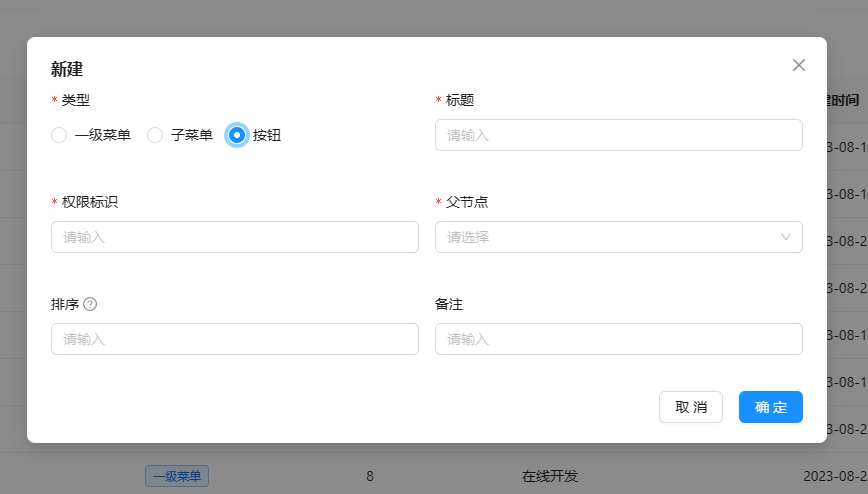

# 权限管理

什么是权限，我们希望不同的人看到不同的页面，访问不同的系统资源，前台用户只可以看到前台拥有的页面和资源，而我们可以访问的资源，就是我们拥有的权限，
我们不希望某些用户访问敏感的资源，所以需要权限控制来做到这一点。
:::success
如果你首次了解我们的权限控制系统，建议你结合代码阅读完本文章，你会有不一样的体验。
:::

## 分配权限

我们在管理用户权限的时候，一般需要将某一部分人设置权限，所以用户组就产生了，我们可以将一部分人加入到一个用户组中，然后设置用户组的权限，这样所在用户组就可以访问该用户组中的内容

我们拥有 客户端 和 管理端 两套权限系统，它们基本相似，分别在管理后台的管理员设置和用户设置中，打开它你会发现，管理端的权限和左手边的菜单栏非常相似，没错，它就是菜单权限控制，在它的子项里面有二级菜单和按钮权限
每一项都代表着一个权限



接下来我们打开用户组页面，来给用户组的成员分配权限，如图所示



## 代码中的权限

上面介绍的都是权限的使用，我们在开发的过程中，难免会新增权限来控制我们新增加的功能，权限分为几种一下几种

## 页面菜单权限

每一个菜单都代表这一个可访问的页面，我们在添加菜单的同时也添加的菜单相对应的权限，如果你不清楚怎么新增页面请查看开发教程

我们新增一个页面，UmiJs 会通过文件系统添加一个前端路由，比如我在 新增了一个页面文件 `pages\HelloWord\index.tsx` ， 它对应的路由是：/HelloWord
我们在权限管理中新增一个一级或者二级菜单，然后将改路由添加进入，就等于说新增加了一条权限，新增权限的表单如图：



接下来我们详细简介表单的内容

### 类型

页面菜单的权限一般为一级菜单和二级菜单

### 标题

菜单的名字，将会显示在左侧菜单栏中的名字

### 路由地址

以文件夹 pages 为根路径的文件路径，它会是我们导航到的地址，也用做权限校验，index.tsx 可以省略。比如页面文件 `pages\HelloWord\index.tsx` ， 它对应的路由是：/HelloWord，你可以通过前端基础路由来了解路由的详细内容

### 图标

菜单栏展示的图标

### 排序

菜单展示的顺序

### 备注

...

我们创建了一个菜单权限，接下来在用户组中找到你所在的用户组，将你添加的权限分配给你的用户组，之后刷新页面，它就会展示在菜单栏中，如果你的文件也创建并且存在内容，点击就会导航到你创建的页面

## 元素按钮权限

每一个按钮权限都代表着页面中的一个元素，你可以控制它是否显示，或者无权限时的显示内容，和新增菜单权限一样，新增按钮权限，只需要将类型改为按钮即可



接下来我们详细简介表单的内容

### 标题

页面元素的辨识标题

### 权限标识

权限标识是按钮权限的关键，我们约定按钮的权限标识为 `页面路由 + 标识名称`，用英文 `. ` 分割, 比如我们的页面元素在文件 `pages\HelloWord\index.tsx` 中 ，它对应的路由是：/HelloWord，按钮权限标识为 `HelloWord.buton`，
`button` 为当前按钮的标识名称。

### 父节点

当前按钮所在的页面位置

### 排序

菜单展示的顺序

### 备注

...

这样我们就新增加了一条页面元素按钮权限，接下来我们将使用这条权限比如我们有下面这样一个按钮

```tsx | pure
// index.tsx
import { Button } from 'antd';
import React from 'react';

const Name: React.FC = () => {
  return (
    <>
      <Button>按钮</Button>
    </>
  );
};
```

我们想控制这个按钮的权限，就可以使用 UmiJs 的 Access 组件来控制它，它有以下属性

#### accessible

是否有权限，通常通过 useAccess 获取后传入进来。

#### fallback

无权限时的显示，默认无权限不显示任何内容。

#### children

有权限时的显示。

我们使用上面新增的一条按钮权限来控制，完整代码如下

```tsx | pure
// index.tsx
import { Button } from 'antd';
import React from 'react';
import { Access, useAccess } from '@umijs/max';

const Name: React.FC = () => {
  const access = useAccess();

  return (
    <>
      {/* 这里的 HelloWord.buton 就是刚才添加的权限标识 */}
      <Access
        accessible={access.buttonAccess('HelloWord.button')}
        fallback={<div>你没有权限！</div>}
      >
        <Button>按钮</Button>
      </Access>
    </>
  );
};
```

当然 `<Button>按钮</Button>` 可以是页面上的任何元素，更高级的用法可以查看 <a href="https://umijs.org/docs/max/access" target="_blank" rel="noreferrer">UmiJs 权限</a>

## 接口访问权限

我们采用 php 8 注解的方式来实现 控制器接口的权限验证只需要一个 `#[Auth]` 就可以控制权限，Auth 是一个注解类，它负责控制器接口权限的验证

使用方法如下

```php
// 当前控制器的权限名称
protected string $authName = 'HelloWord';

#[Auth]
public function getuser()
{
    return $this->success('你有权限')
}

```

添加以上代码，系统会验证当前用户是否登录

```php

// 当前控制器的权限名称
protected string $authName = 'HelloWord';

#[Auth('button')]
public function getuser()
{
    return $this->success('你有权限')
}

```

添加以上代码，系统会验证访问当前控制器的用户是否拥有 `HelloWord.button` 权限
没错，按钮权限就可以用来当作 Api 权限使用，当然你也可以分开来使用它

你也可以在控制器的类名之上添加注解验证，它会校验当前控制器类的所有方法是否拥有权限

```php
// 注解验证当前控制器类需要登录访问
#[Auth]
class HelloWord {

  protected string $authName = 'HelloWord';

  // 注解验证当前方法的权限
  #[Auth('button')]
  public function getuser()
  {
      return $this->success('你有权限')
  }

}

```

:::info
当你的用户组为管理员它将忽略权限校验
:::

```php
#[Auth('list')]
```

### 完整例子

```php {8} | pure
// 引入注解类 Auth
use app\common\attribute\Auth;
use app\common\controller\Controller;

class AuthTest extends Controller
{
    // 使用注解类
    #[Auth('list')]
    public function list(): Json
    {
        list($where, $paginate) = $this->buildSearch();
        $list = $this->model
            ->with($this->withModel)
            ->where($where)
            ->paginate($paginate)
            ->toArray();
        return $this->success('ok', $list);
    }
}

```

假设你的控制器访问路径为 `admin.php\auth.authtext\list`，那么当前权限规则 KEY 为：`auth.authtext.list`，XinAdmin 会校验当前用户是否拥有 `auth.authtext.list` 权限；

你可以在路由中新增 按钮/操作 并且 权限标识 为 `auth.authtext.list`，并且将 该权限分配给用户所在的用户组中，之后就可以访问当前方法

## 自定义权限前缀

XinAdmin 默认从当前控制器路径获取权限前缀 ，当然你也可以通过自定义当前控制器权限前缀来修改它

使用 $authName 来自定义控制器权限前缀

```php
protected string $authName = 'auth';
```

### 完整例子

```php
// 引入注解类 Auth
use app\common\attribute\Auth;
use app\common\controller\Controller;

class AuthTest extends Controller
{
    protected string $authName = 'auth';

    // 使用注解类
    #[Auth('list')]
    public function list(): Json
    {
        list($where, $paginate) = $this->buildSearch();
        $list = $this->model
            ->with($this->withModel)
            ->where($where)
            ->paginate($paginate)
            ->toArray();
        return $this->success('ok', $list);
    }
}

```

自定义当前控制器权限前缀，那么当前方法权限标识 为：`auth.list`，规则为：`$authName . 'list'` XinAdmin 会校验当前用户是否拥有 `auth.list` 权限；

你可以在路由中新增 按钮/操作 并且 权限标识 为 `auth.list`，并且将 该权限分配给用户所在的用户组中，之后就可以访问当前方法

## 校验登录

当然你也可以使用 Auth 类来校验当前用户是否登录，适用于有些场景只用校验用户是否登录，并不需要对某些操作进行特定控制；

```php
// 引入注解类 Auth
use app\common\attribute\Auth;
use app\common\controller\Controller;

class AuthTest extends Controller
{
    protected string $authName = 'auth';

    // 使用注解类
    #[Auth]
    public function list(): Json
    {
        list($where, $paginate) = $this->buildSearch();
        $list = $this->model
            ->with($this->withModel)
            ->where($where)
            ->paginate($paginate)
            ->toArray();
        return $this->success('ok', $list);
    }
}

```

我们可以直接使用 `#[Auth]` 来校验用户是否登录，如果没有登录将返回 error；

## Auth Api

我们在 Auth 中封装了一些比较常用的 Api 你可以使用这些 静态方法快速的获取到当前用户的登录状态和基本信息

### 判断是否登录

```php
Auth::isLogin(); // bool
```

### 获取 Token Data

```php
Auth::getTokenData(); // array
```

### 获取管理员 ID

```php
Auth::getAdminId(); // int
```

### 获取管理员信息

```php
Auth::getAdminInfo(); // array
```

### 获取前台用户 ID

```php
Auth::getUserId(); // int
```

### 获取前台用户信息

```php
Auth::getUserInfo(); // array
```
