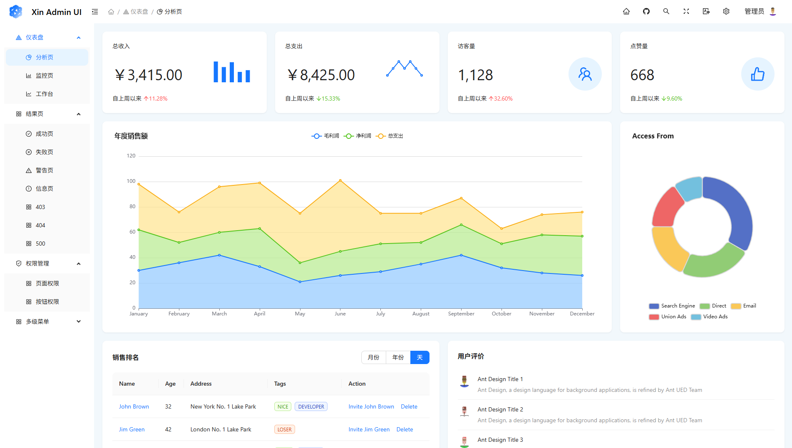

# 简介

:::tip
本项目采用 [MIT License](https://github.com/xin-admin/xin-admin/blob/master/LICENSE) 开源协议，无需授权即可免费商用
:::

XinAdmin 是基于 Ant Design 设计规范封装一套企业级中后台前端模板，使用最新的前端技术栈，包括 `React 19`、`Vite 6`、`ReactRouter 7`、`zustand 5`、`  Typescript`。
依靠 AntDesign 设计规范，致力于在设计规范和基础组件的基础上，继续向上构建，提炼出符合中后台适用的前端模板，
并附带中后台场景中常用的业务组件，适用于多种场景。此外它还采用了 `msw` 数据 MOCK 方案，体验真正无缝的 API 模拟体验，使企业级中后台产品的研发更快一步。

### 特性

- **前言技术栈应用**：采用 `React 19`、`Vite 6`、`ReactRouter 7`、`zustand 5`、`  Typescript` 构建。
- **AntDesign 设计规范**：通过模块化解决方案，降低冗余的生产成本，让开发者专注于更好的用户体验。
- **清晰的代码目录**：语义化目录命名规范，API、Domain等模块独立命名空间，简单易用。
- **TypeScript**： 支持严格的类型检查，提高代码的可维护性。
- **丰富的主题配置**：基于AntDesign设计规范，内置多样的主题配置，随心搭配自己的风格。
- **内置国际化方案**：轻松实现多语言支持。
- **ReactRouter v7**：采用 ReactRouter 7 DataMode 支持后端动态路由，自动生成菜单，支持页面嵌套路由。
- **丰富的页面组件**：内置多样页面和组件，包括403、404、500页面，以及布局组件、标签组件、主题配置组件等。
- **TailwindCSS**： 只需书写 HTML 代码，无需书写 CSS，搭配 AntDesign 让开发更简单。

### 文档

XinAdmin 文档基于 `docusaurus` 书写，地址为：[https://xinadmin.cn/ui/intro](https://xinadmin.cn/ui/intro)，如发现文档有误，欢迎提 pr 帮助我们改进。

### 新手须知

XinAdmin 在力求提供开箱即用的开发体验，为此我们提供完整的脚手架，涉及国际化，权限，mock，数据流，网络请求等各个方面。为这些中后台中常见的方案提供了最佳实践来减少学习和开发成本，但是为了方便你更快的了解 XinAdmin
推荐你去学习和了解以下技术文档：

- [ES6+]( https://es6.ruanyifeng.com/)
- [React]( https://react.dev/ )
- [AntDesign]( https://ant.design/ )
- [Vite]( https://vite.dev/ )
- [ReactRoute V7](https://reactrouter.com/)
- [Axios](https://axios-http.com/)
- [mswjs](https://mswjs.io/)
- [tailwindcss](https://tailwindcss.com/)
- [echarts](https://echarts.apache.org/)

### 兼容环境

:::tip
本地开发推荐使用`Chrome 100+` 浏览器
:::

- 现代浏览器
- 支持服务端渲染。
- Electron

|  Edge |  Firefox |  Chrome |  Safari |  Opera |  Electron |
|--------------------------------------------------------------------------------------------------------------------------------------------------------------------------------------------------------|-------------------------------------------------------------------------------------------------------------------------------------------------------------------------------------------------------------------|----------------------------------------------------------------------------------------------------------------------------------------------------------------------------------------------------------------|----------------------------------------------------------------------------------------------------------------------------------------------------------------------------------------------------------------|------------------------------------------------------------------------------------------------------------------------------------------------------------------------------------------------------------|------------------------------------------------------------------------------------------------------------------------------------------------------------------------------------------------------------------------|
| Edge                                                                                                                                                                                                   | last 2 versions                                                                                                                                                                                                   | last 2 versions                                                                                                                                                                                                | last 2 versions                                                                                                                                                                                                | last 2 versions                                                                                                                                                                                            | last 2 versions                                                                                                                                                                                                        |

### 社区互助

如果您在使用的过程中碰到问题，可以通过下面几个途径寻求帮助，同时我们也鼓励资深用户通过下面的途径给新人提供帮助。

通过 GitHub Discussions 提问

提交 Github Issues

加入官方QQ群来解答 [Xin Admin 官方交流群](https://qm.qq.com/q/4hxyJo0Oly)

目前项目正处于快速更新迭代阶段，正式开发时如更新版本请先备份项目