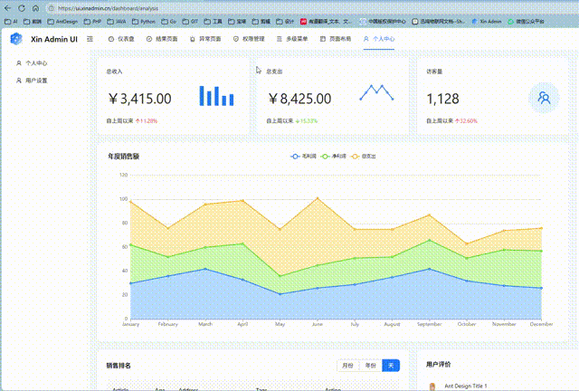

# 嵌套路由



XinAdmin 支持页面中嵌套路由，以实现对某些页面中标签页的动态路由加载。如果你需要使用嵌套路由，首先你要有一个页面路由，类似的配置如：

```ts

const route = [
  {
    id: 32,
    pid: 30,
    type: 'route',
    name: '用户设置',
    local: "menu.user.setting",
    icon: "UserSwitchOutlined",
    key: 'user.setting',
    path: '/user/setting',
    elementPath: '/user/setting/index',
  }
]

```

上面我们定义了一个页面路由，它会生成一个菜单，并且菜单的页面组件为 `src/pages/user/setting/index.tsx`。

当我们在这个页面中希望有多个标签页，并且标签页用路由动态加载：

```tsx
// src/pages/user/setting/index.tsx

export default () => {
  const tabsList = [
    {
      label: '基本信息',
      key: '/user/setting',
    },
    {
      label: '安全设置',
      key: '/user/setting/security',
    },
    {
      label: '实名认证',
      key: '/user/setting/verification',
    },
  ]


  return (
    <>
      <Tabs
        onChange={(key) => {
          // 在点击切换标签的时候，跳转到对应的路由
          navigate(key)
        }}
        items={tabsList}
      />
      <div> 点击切换标签的时候，这个地方会加载相应的组件，以实现嵌套路由 </div>
    </>
  )
}
```

当点击标签的时候，我们不希望切换整个页面，而是切换这个页面中嵌套的一部分组件，下面我们就利用嵌套路由来实现这一点。

首先我们新增两个组件，分别用于显示 `基本信息` 和 `安全设置`。

```tsx
// src/pages/user/setting/basic.tsx
export default () => {
    return <> 基本信息 </>
}

// src/pages/user/setting/security.tsx
export default () => {
  return <> 安全设置 </>
}
```

然后我们添加这两个组件的规则：

```ts
const route = [
  {
    id: 32,
    pid: 30,
    type: 'route',
    name: '用户设置',
    local: "menu.user.setting",
    icon: "UserSwitchOutlined",
    key: 'user.setting',
    path: '/user/setting',
    elementPath: '/user/setting/index',
  },
  {
    id: 33,
    pid: 32,
    type: 'nested-route',
    name: '基本信息',
    key: 'user.setting.info',
    path: '/user/setting',
    elementPath: '/user/setting/info',
  },
  {
    id: 34,
    pid: 32,
    type: 'nested-route',
    name: '安全设置',
    key: 'user.setting.security',
    path: '/user/setting/security',
    elementPath: '/user/setting/security',
  },
]
```
:::warning
嵌套路由必须有默认的显示内容，我们在封装的时候将路由的第一个嵌套路由作为索引路由，来实现默认显示
:::

最后一步，我们将路由组件 `<Outlet />` 添加到页面中需要显示的部分

```tsx
// src/pages/user/setting/index.tsx

export default () => {
  const tabsList = [
    {
      label: '基本信息',
      key: '/user/setting',
    },
    {
      label: '安全设置',
      key: '/user/setting/security',
    }
  ]


  return (
    <>
      <Tabs
        onChange={(key) => {
          // 在点击切换标签的时候，跳转到对应的路由
          navigate(key)
        }}
        items={tabsList}
      />
      {/*<div> 点击切换标签的时候，这个地方会加载相应的组件，以实现嵌套路由 </div>*/}
      <Outlet />
    </>
  )
}
```

这样我们就实现了在页面中嵌套路由。
