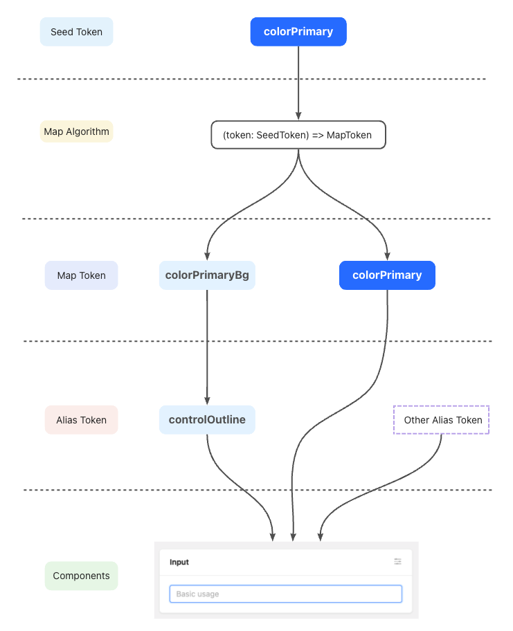

# 定制主题

XinAdmin 基于 AntDesign 封装，你可以使用 AntDesign 的主题算法来进行风格配置。
如果你不知道AntDesign 该如何定制主题，请查阅 AntDesign [定制主题](https://ant-design.antgroup.com/docs/react/customize-theme-cn) 文档。

### 修改主题变量

我们在布局文件中使用 `ConfigProvider` 进行主题配置，并且支持动态切换，你可以使用 `主题管理器` 来修改这些颜色变量。

:::warning
请不要直接修改 `layout/index.ts` 中的主题变量来配置主题，除非你知道为什么该这么做，否则会导致 `主题管理器` 失效。
:::

### 主题算法

我们将AntDesign的主题算法作为配置项，集成在主题管理器中，你在布局页面的 `layout\algorithm.ts` 文件中即可查看默认的四种算法，你也可以在此文件中定义你自己的算法。

**默认算法**

```ts
// src\layout\algorithm.ts 
import { theme } from "antd";

// AntDesign 算法，你可以在此自定义你的算法
const algorithm = {
  // 默认算法
  defaultAlgorithm: theme.defaultAlgorithm,
  // 暗黑模式算法
  darkAlgorithm: theme.darkAlgorithm,
  // 默认 + 紧凑算法
  defaultCompactAlgorithm: [theme.defaultAlgorithm, theme.compactAlgorithm],
  // 暗黑 + 紧凑算法
  darkCompactAlgorithm: [theme.darkAlgorithm, theme.compactAlgorithm],
};
```

值得注意的是，AntDesign并没有过于的将算法进行说明，实际上算法就是将 `基础变量（Seed Token）` 转变为 `梯度变量（Map Token）` 的过程，通过修改算法可以快速生成风格迥异的主题。



你可以参考 [定制主题](https://ant-design.antgroup.com/docs/react/customize-theme-cn) 进行配置。