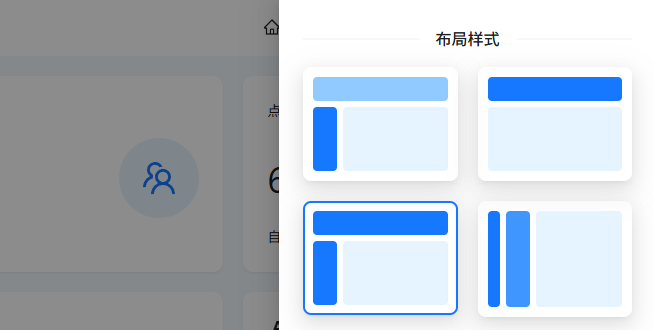

# 主题管理器

我们通过 `zustand` 对主题进行统一状态管理，并且将其所有可配置的项目封装成了一个 `SettingDrawer` 组件，
你可以通过顶栏的 ⚙️ 设置按钮来打开主题管理器并且对主题进行设置，`zustand` 会将你的配置自动缓存到本地储存中，
刷新页面时，主题管理器会自动读取本地储存中的配置，并应用到页面中。

### 布局样式

左侧导航：将所有的 Menu 导航栏都放到侧边来展示。

顶部导航：将所有的 Menu 导航栏都放到顶栏来展示。

混合导航：将一级导航栏放到顶部展示，选择顶部导航栏，侧栏会自动显示对应的子菜单。

双栏导航：将一级导航栏放到左侧展示，选择左侧导航栏，右侧会自动显示对应的子菜单。

### 预设主题

我们通过 AntDesign 的主题 token，提供了几种主题的预设，并且包含暗黑主题算法， 你也可以阅读 AntDesign 的主题来获取更多自定义配置配置。

### 颜色与风格

在不同的应用场景下，可能你需要对默认的主题样式进行特殊的定制，我们推荐你查看 [AntDesign 的主题算法](https://ant.design/docs/react/customize-theme-cn#%E4%BD%BF%E7%94%A8%E9%A2%84%E8%AE%BE%E7%AE%97%E6%B3%95)，来进行风格配置。